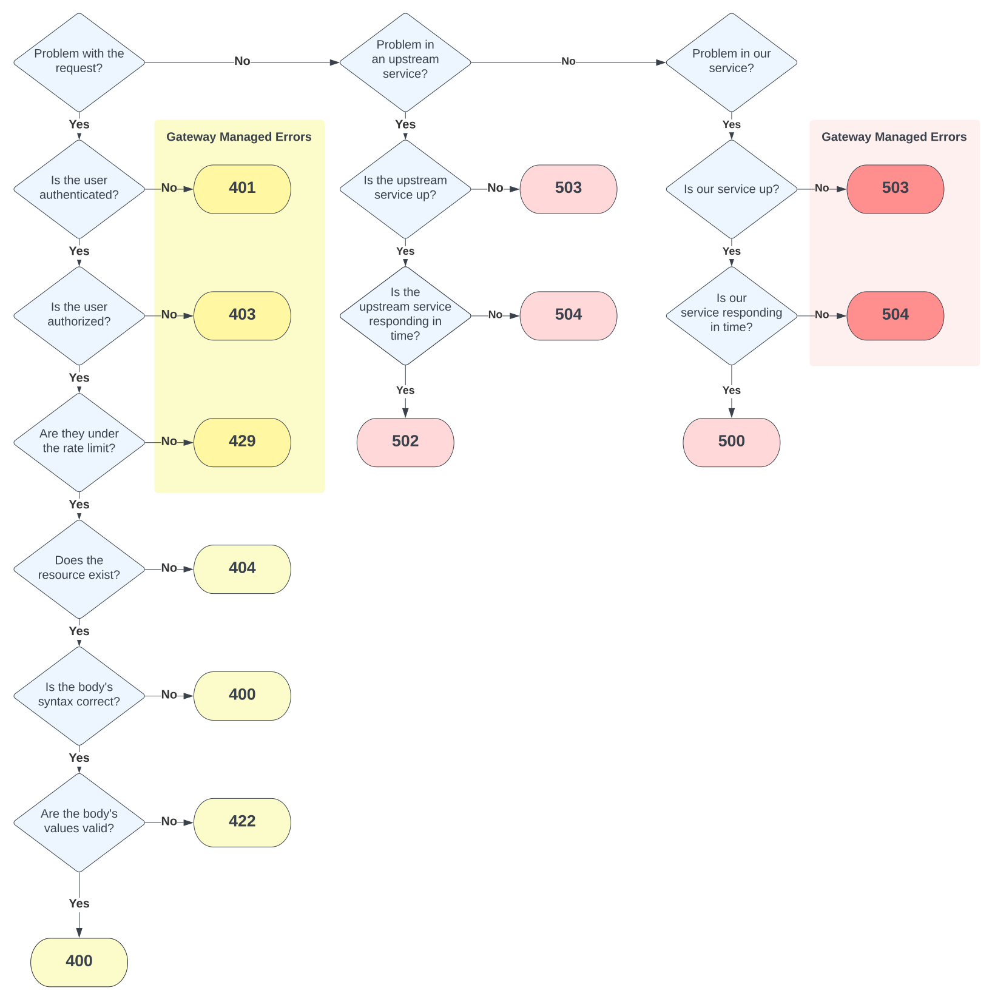

# Errors

!!! success "Guidance"
    - Error fields **should** follow [RFC 7807](https://datatracker.ietf.org/doc/html/rfc7807#section-3.1)
    - An operation **should** be able to return multiple errors in one response.
    - The `status` field **should** match the HTTP status code being returned.
    - The `title` field **should** be the generic class of the error and consistent across the API.
    - The `detail` field **should** be specific to the error at hand.
    - If an error is in the request, a `source` field **should** point to it.


## Error Schemas

The error schema should match that of the [information model](../../general-guidelines/data-interchange#information-models) you are using. This guide recommends using [JSON::API](https://jsonapi.org/) unless an industry-specific format like [FHIR](http://hl7.org/fhir/) is required. We recommend JSON::API because it has a well thought-out, extensible, and relatively simple error model.

An example of a JSON::API-formatted 422 'Unprocessable Entity' error is:

```json title="422 Unprocessable Entity"

{
  "errors": [
    {
      "status": "422",
      "source": { "pointer": "/data/attributes/isRefillable" },
      "title": "Invalid Attribute",
      "detail": "isRefillable must be a boolean value."
    }
  ]
}

```

FHIR has a different error schema [(OperationOutcome resource)](https://www.hl7.org/fhir/operationoutcome.html). An example is:

```json
{
  "resourceType": "OperationOutcome",
  "id": "searchfail",
  "text": {
    "status": "generated",
    "div": "<div xmlns=\"http://www.w3.org/1999/xhtml\">\n<p>The &quot;name&quot; parameter has the modifier &quot;exact&quot; which is not supported by this server</p>\n</div>"
  },
  "issue": [
    {
      "severity": "fatal",
      "code": "code-invalid",
      "details": {
        "text": "The \"name\" parameter has the modifier \"exact\" which is not supported by this server"
      },
      "location": [
        "http.name:exact"
      ]
    }
  ]
}
```

## Multiple errors

Operations should be able to return multiple errors and providers should return errors for all the issues with the request at once. For example, if 2 fields are invalid, return both so the consumer is aware of all the issues that must be corrected, instead of raising an error once the first invalid field is processed. If the error statuses are different but have the same hundredth, for example, both are `4xx`, return the base generic value (`400`). If the errors have mixed hundredth values return a `500`.

```json title="422 Unprocessable Entity"

{
  "errors": [
    {
      "status": "422",
      "source": { "pointer": "/data/attributes/isRefillable" },
      "title": "Invalid Attribute",
      "detail": "isRefillable must be a boolean value."
    },
    {
      "status": "422",
      "source": { "pointer": "/data/attributes/contactEmail" },
      "title": "Invalid Attribute",
      "detail": "contactEmail must be a valid email address."
    }
  ]
}

```


## Choosing an error code

Choosing the correct HTTP status code for an error can be confusing. With VA APIs, the error will originate from one of three sources: from the consumer’s request; an upstream service the API depends on; or the API itself, such as the web application and its components.

- Request errors: Issues caused by requests are a flavor of a `400` error (`4xx`).
- Upstream errors: Errors from upstream services are `502`, `503`, or `504`.
- Application errors: Always return a `500`.

The Lighthouse gateway will handle some of these errors for you. Within the 4xx range, the gateway handles the authorization and authentication errors (`401` and `403`) as well as the rate limiting errors (`429`). The gateway will also handle your service being unavailable (`503`) or failing to respond to a request in time (`504`).

The flowchart below can help you decide which HTTP status code to return for an error.


