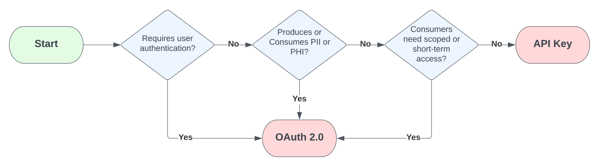

# Security

## Provider authentication and authorization

Lighthouse can help protect access to your APIs with a layer of [FedRAMP](https://www.fedramp.gov/)-approved authentication (AuthN) and authorization (AuthZ) using API keys or OAuth 2.0. Whether your API uses an API key or OAuth 2.0 integration pattern depends on the needs of your API, such as the type of users or data involved.

APIs that involve user authentication, personally identifiable information (PII), protected health information (PHI), or scoped or time-limited access will use OAuth 2.0. Otherwise, your API will use an API key.

The flowchart below can help you determine which one to use.

