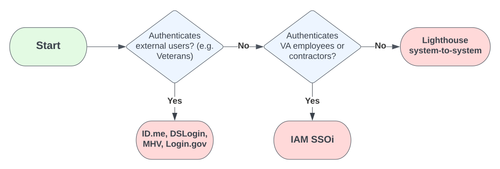

# Identity providers

Lighthouse OAuth supports multiple identity providers to meet the needs of your API. Access token formats and structures will vary based on the identity provider. The flowchart below can help you determine which format or structure applies.

## External (ID.me, DSL, MHV, Login.gov)
Lighthouse partners with multiple external identity providers to allow authentication of external users, such as Veterans.

- External users must be identity-proofed. They require multi-factor authentication (MFA).
- Shared test accounts are available in the sandbox environment. Learn more about [test accounts](https://github.com/department-of-veterans-affairs/vets-api-clients/blob/master/test_accounts.md).
- Access tokens issued for external users will be signed JSON Web Tokens (JWTs).
- Details on identifying the user context are in the section about [Token Validation](../../../security/oauth/token-validation).

## Internal (IAM SSOi)
Lighthouse partners with VA's identity and access management (IAM) system to allow authentication and single-sign-on of internal users such as VA employees and contractors.

- Internal users require a PIV card or Windows authentication to obtain an OAuth access token.
- Shared test accounts are available in the sandbox environment. Access them in the [test persona manager](https://tpm.preprod.iam.va.gov/tpm/) through the VA network.
- Access tokens issued for internal users will be opaque tokens.
- For details on identifying the user context, see [Token Validation](../../../security/oauth/token-validation).

!!! info
    - For internal users, Lighthouse performs only authentication. 
    - If needed, your API should implement any fine-grained authorization or role-based access control (RBAC).

## System-to-system

Lighthouse allows systems to obtain an OAuth access token for interacting with an API outside of the context of a user.

- Systems will authenticate using client-owned, asymmetric, public/private keys for enhanced security. Learn more in [private_key_jwt authentication](https://openid.net/specs/openid-connect-core-1_0.html#ClientAuthentication).
- Access tokens issued for systems will be signed [JSON Web Tokens (JWTs).
- For details on identifying the consuming system, go to the section on [Token Validation](../../../security/oauth/token-validation). 
